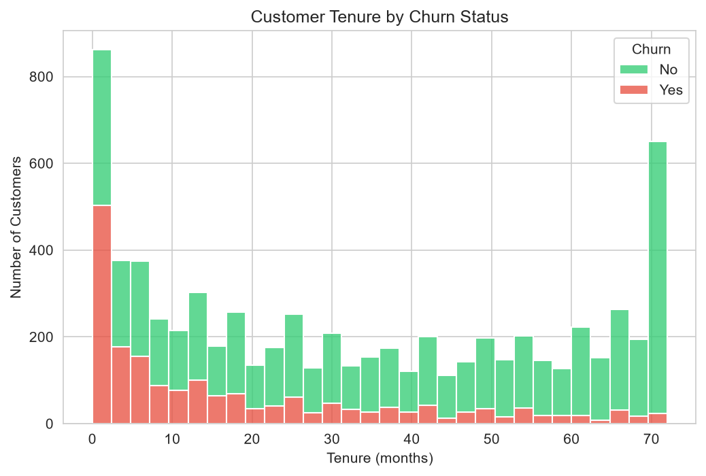
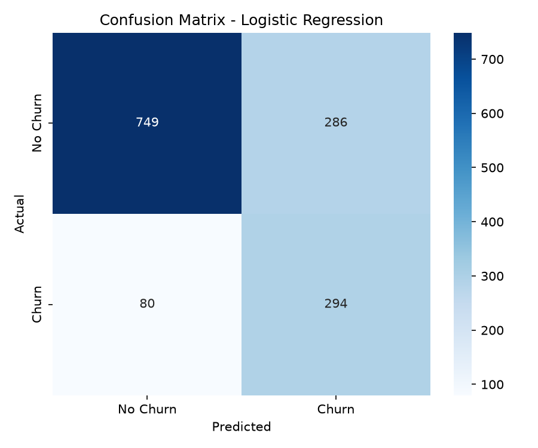
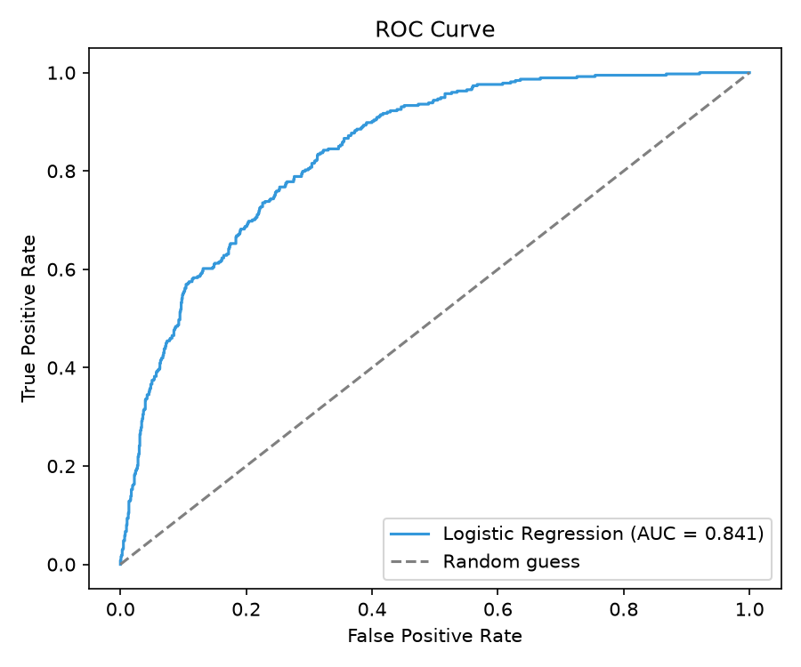
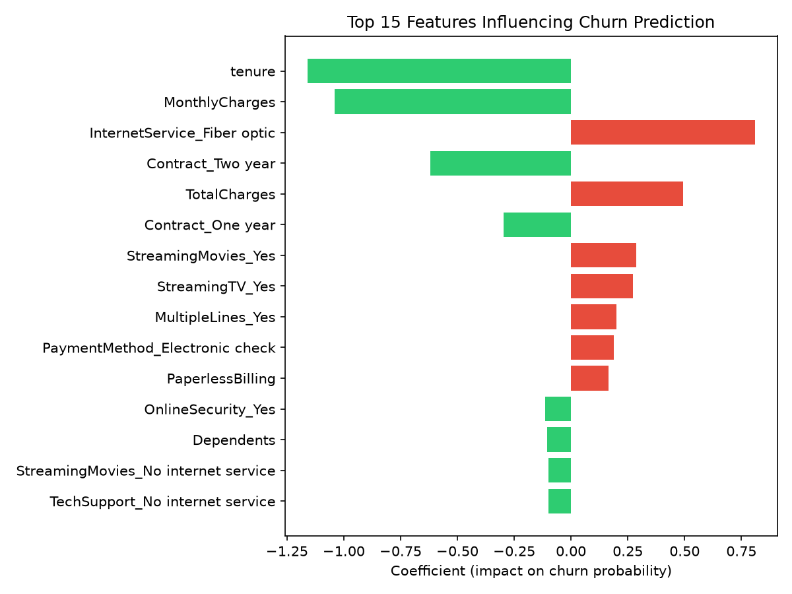
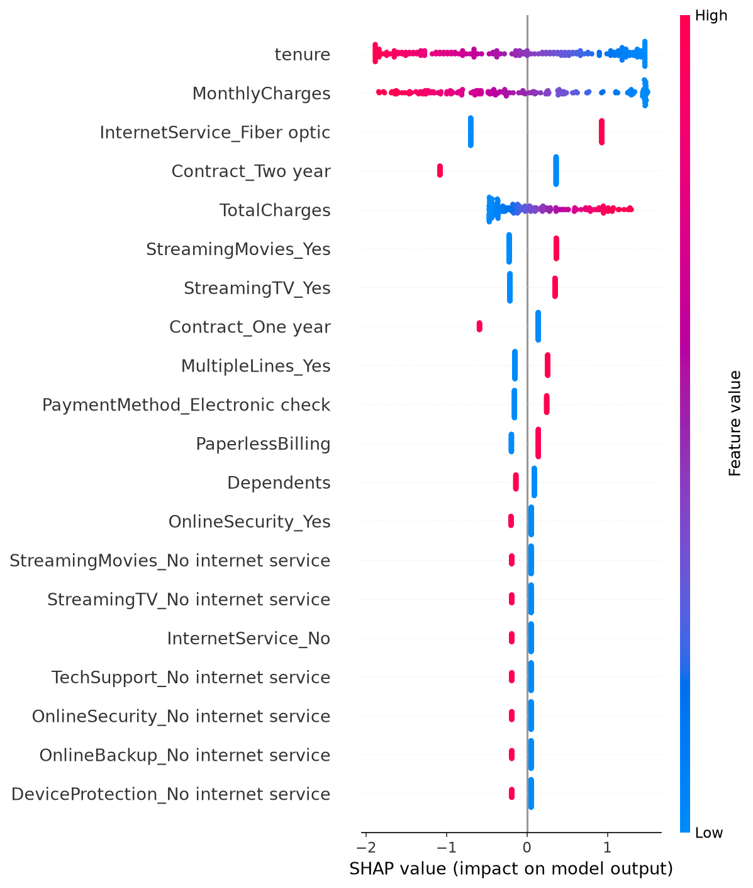

🇬🇧 [Read in English](README.md) | 🇫🇷 Version française ci-dessous

---

# Prédiction du Churn Client

Projet de Machine Learning prédisant le désabonnement (churn) des clients d'une entreprise de télécommunications, réalisé avec Python et scikit-learn. Le modèle final (régression logistique) atteint un AUC de 0,84 et identifie les principaux facteurs de départ des clients, fournissant des recommandations exploitables pour des stratégies de rétention.

## Contexte métier

Le churn client (quand un client cesse d'utiliser les services d'une entreprise) est l'un des problèmes les plus coûteux pour les entreprises fonctionnant par abonnement. Acquérir un nouveau client coûte généralement bien plus cher que de fidéliser un client existant, ce qui fait de la prédiction du churn un cas d'usage à forte valeur ajoutée pour le Machine Learning.

Ce projet vise à répondre à trois questions :
- Quels clients sont les plus susceptibles de se désabonner ?
- Quels facteurs influencent cette décision ?
- Comment ces informations peuvent-elles alimenter des stratégies de rétention ?

En identifiant les clients à risque avant qu'ils ne partent, une entreprise peut les cibler de façon proactive avec des offres de fidélisation, ce qui peut représenter une économie de revenus significative.

## Jeu de données

Le projet utilise le jeu de données [Telco Customer Churn](https://www.kaggle.com/datasets/blastchar/telco-customer-churn) issu de Kaggle (publié à l'origine par IBM).

- **7 043 clients**, 21 variables
- **Variable cible :** `Churn` (Oui/Non) : 26,5% des clients se sont désabonnés
- **Variables incluses :** données démographiques (genre, statut senior), informations de compte (ancienneté, type de contrat, mode de paiement), et services souscrits (internet, téléphone, streaming, support technique)

## Méthodologie

1. **Analyse exploratoire des données (EDA)** : comprendre la qualité des données, la distribution des classes, et les relations entre les variables et le churn
2. **Préparation des données** : nettoyage des valeurs manquantes, encodage des variables catégorielles, découpage en ensembles d'entraînement/test (80/20, stratifié)
3. **Entraînement des modèles** : entraînement et comparaison de trois classifieurs (régression logistique, Random Forest, XGBoost) avec validation croisée à 5 plis
4. **Évaluation des modèles** : évaluation du meilleur modèle sur l'ensemble de test à l'aide de la précision, du recall, du F1-score et de l'AUC-ROC
5. **Interprétabilité** : analyse de l'importance des variables et des valeurs SHAP pour expliquer les prédictions individuelles

## Principaux enseignements de l'EDA

- **L'ancienneté est le facteur de fidélisation le plus fort** : les clients avec une faible ancienneté (0-5 mois) se désabonnent bien plus souvent que les clients fidèles depuis longtemps (60+ mois)
- **Le type de contrat a un impact majeur** : les clients sans engagement (mensuel) se désabonnent 15 fois plus souvent que les clients en contrat de deux ans (42,7% contre 2,8%)
- **Les clients fibre optique se désabonnent le plus (41,9%)**, malgré un prix moyen plus élevé (91,50$/mois contre 58,10$ pour l'ADSL), ce qui suggère une sensibilité au prix ou des problèmes de qualité de service
- **Déséquilibre des classes :** seulement 26,5% des clients se sont désabonnés, ce qui a orienté le choix des métriques d'évaluation et de la stratégie de modélisation (voir ci-dessous)



## Résultats de modélisation

Trois modèles ont été entraînés et comparés par validation croisée à 5 plis (F1-score) :

| Modèle | F1-score moyen |
|---|---|
| **Régression logistique** | **0,632** |
| Random Forest | 0,604 |
| XGBoost | 0,574 |

La régression logistique a été retenue comme modèle final. Malgré sa simplicité, elle surpasse des modèles à base d'arbres plus complexes, probablement parce que les relations entre les variables et le churn sont largement linéaires (comme confirmé par l'EDA), et parce que XGBoost a été utilisé sans réglage d'hyperparamètres. Ce résultat souligne que la complexité d'un modèle ne se traduit pas toujours par une meilleure performance, en particulier sur des jeux de données de taille modeste et bien compris.

### Performance sur l'ensemble de test

| Métrique | Pas de churn | Churn |
|---|---|---|
| Précision | 0,90 | 0,51 |
| Recall | 0,72 | 0,79 |
| F1-Score | 0,80 | 0,62 |

**AUC-ROC : 0,841**

Le modèle identifie correctement 79% des clients qui se sont réellement désabonnés (recall), ce qui est crucial dans un contexte métier où ne pas détecter un client en train de partir (faux négatif) coûte plus cher qu'une fausse alerte.




## Interprétabilité du modèle

### Importance des variables

Les coefficients de la régression logistique confirment les tendances identifiées lors de l'EDA : `tenure` (ancienneté) et `Contract_Two year` (contrat 2 ans) sont les facteurs réduisant le plus le risque de churn, tandis que `InternetService_Fiber optic` (fibre optique) et `TotalCharges` (montant total facturé) l'augmentent.



### Analyse SHAP

Pour aller au-delà de l'importance globale des variables, les valeurs SHAP (SHapley Additive exPlanations) ont été utilisées pour comprendre comment chaque variable influence les prédictions individuelles. Cette analyse confirme les mêmes facteurs principaux tout en montrant la direction et l'ampleur de leur effet, client par client, ce qui est utile pour expliquer un score de risque de désabonnement individuel à des interlocuteurs métier.



## Structure du projet

```
churn-prediction/
├── data/
│   ├── raw/                  # Jeu de données original (non versionné)
│   └── processed/            # Données nettoyées et encodées
├── notebooks/
│   └── 01_eda.ipynb          # Analyse exploratoire des données
├── src/
│   ├── data_preprocessing.py # Pipeline de nettoyage et d'encodage
│   ├── train_model.py        # Entraînement et comparaison des modèles
│   └── evaluate.py           # Évaluation et interprétabilité du modèle
├── models/                   # Modèles entraînés (non versionnés)
├── reports/
│   └── figures/               # Graphiques et visualisations générés
├── tests/
│   └── test_preprocessing.py # Tests unitaires du preprocessing
├── requirements.txt
└── README.md
```

## Comment reproduire ce projet

1. Cloner le dépôt :
```bash
git clone https://github.com/AmDiom/churn-prediction.git
cd churn-prediction
```

2. Créer et activer un environnement virtuel :
```bash
python -m venv venv
venv\Scripts\activate  # Windows
```

3. Installer les dépendances :
```bash
pip install -r requirements.txt
```

4. Télécharger le [jeu de données Telco Customer Churn](https://www.kaggle.com/datasets/blastchar/telco-customer-churn) et le placer sous `data/raw/telco_churn.csv`

5. Exécuter le pipeline :
```bash
python src/data_preprocessing.py
python src/train_model.py
python src/evaluate.py
```

6. Lancer les tests :
```bash
pytest tests/ -v
```

## Limites et pistes d'amélioration

- **Pas de réglage d'hyperparamètres** : les modèles ont été entraînés avec des paramètres par défaut ou raisonnables. Une recherche systématique (GridSearchCV, Optuna) pourrait améliorer la performance, en particulier pour XGBoost
- **Jeu de données statique** : le modèle est entraîné sur une photo instantanée des données clients. En production, il faudrait le ré-entraîner régulièrement à mesure que le comportement des clients évolue
- **Pas d'ajustement du seuil de décision selon le coût métier** : le seuil de classification par défaut de 0,5 a été utilisé. Comme les faux négatifs (clients ratés) coûtent plus cher que les faux positifs, ajuster ce seuil pourrait améliorer les résultats business
- **Gestion du déséquilibre des classes** : seuls `class_weight`/`scale_pos_weight` ont été utilisés. Des techniques comme SMOTE pourraient être explorées en comparaison
- **Déploiement** : le modèle n'est pas encore exposé via une API. Un point d'accès FastAPI permettrait un scoring du risque de churn en temps réel

## Technologies utilisées

- **Langage :** Python 3.14
- **Manipulation de données :** pandas, numpy
- **Machine Learning :** scikit-learn, XGBoost
- **Visualisation :** matplotlib, seaborn
- **Interprétabilité :** SHAP
- **Tests :** pytest
- **Environnement :** Jupyter Notebook, VS Code